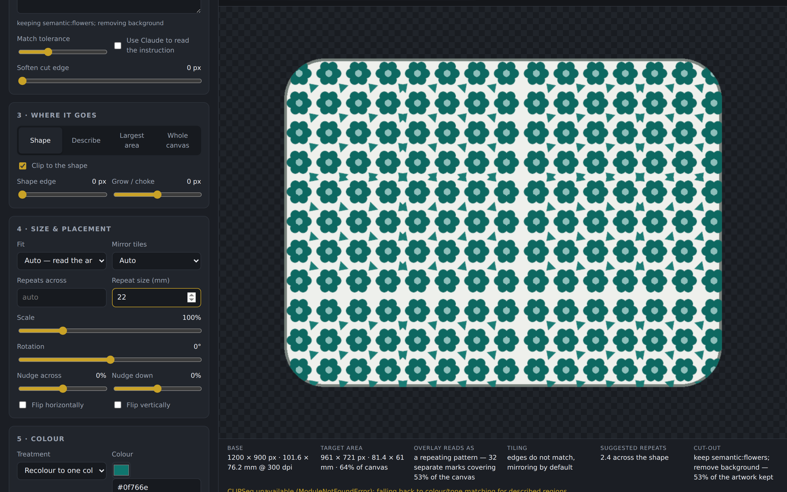
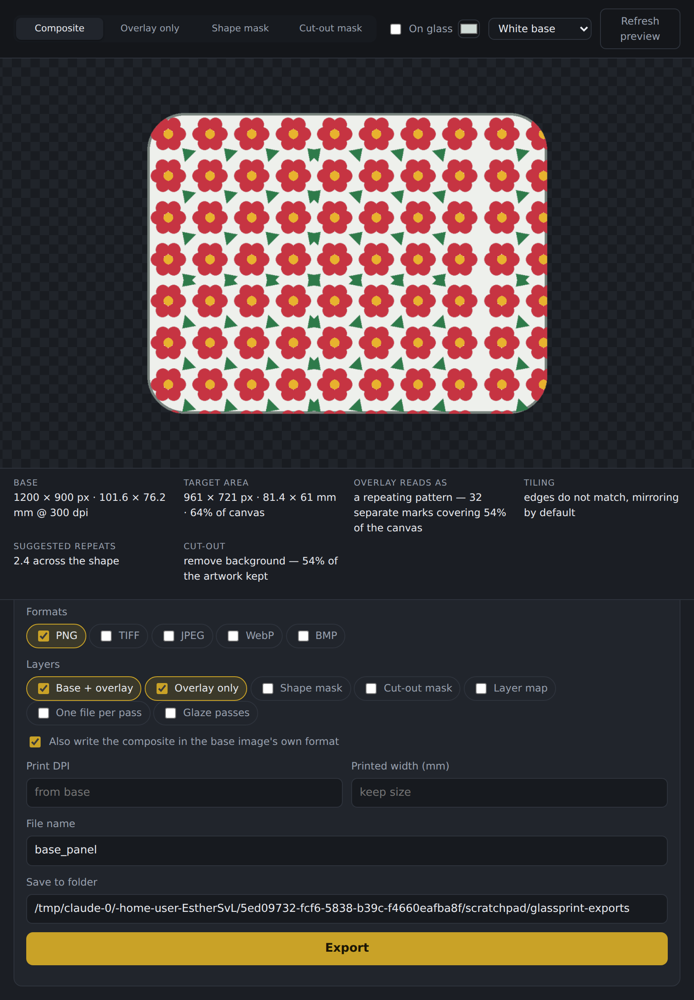
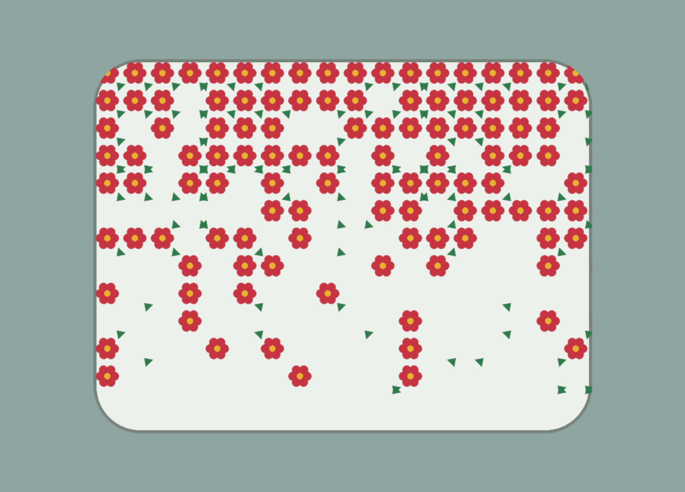
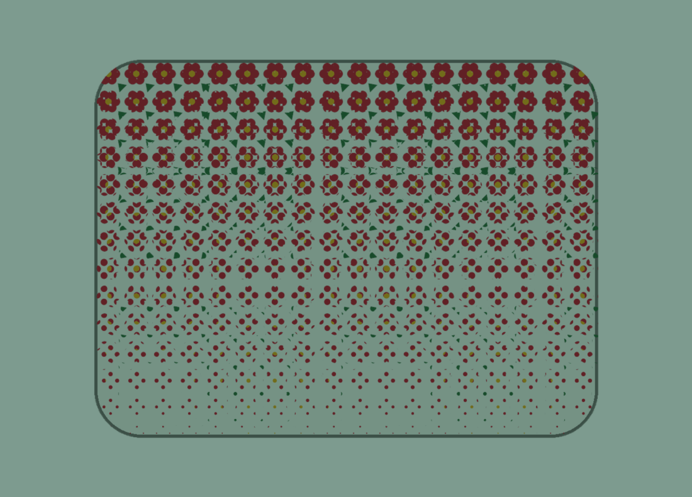
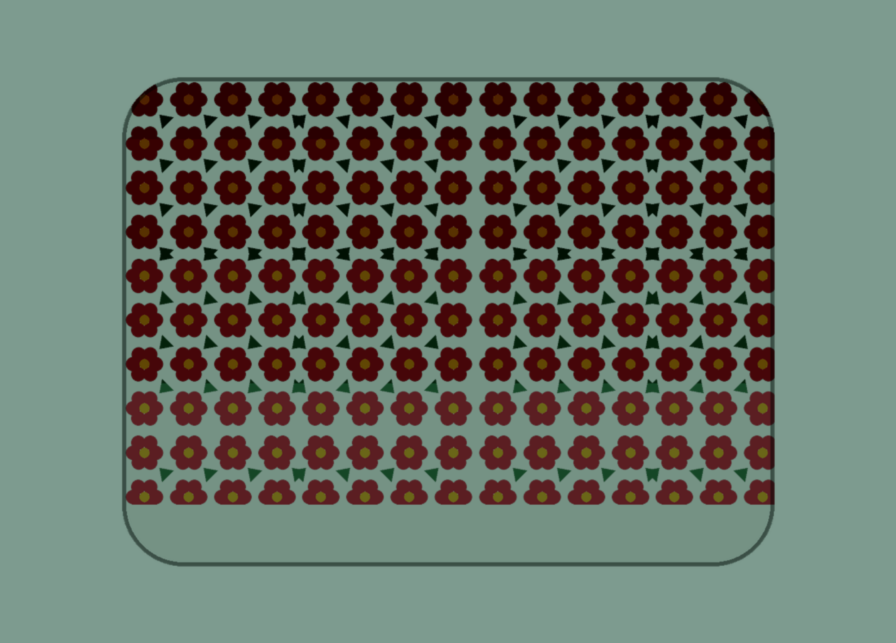
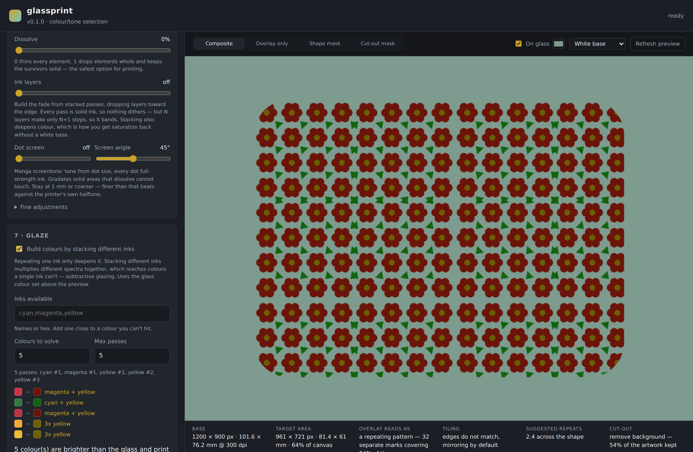

# glassprint

Overlay artwork onto a base image, with the background removed, and export it at
the right physical size for UV printing onto glass.

You give it two things — a base image exported from Procreate or Affinity
Designer, and a pattern or motif — plus a sentence about what to keep. It works
out whether the artwork is a repeating pattern or a single motif, sizes it to
the shape in your base image, clips it to that silhouette, and writes files with
the DPI and millimetre dimensions the printer needs.

Everything runs locally. Nothing is uploaded anywhere unless you explicitly turn
on the optional Claude integration.



---

## Install

The launchers in `launchers/` do all of this for you — double-click
**`Start glassprint (Windows).bat`** (or the `.command` on macOS) and skip to
[Use it](#use-it). By hand:

```bat
git clone https://github.com/EstherSvl/Glassprint.git
cd Glassprint
py -3 -m venv .venv
.venv\Scripts\activate
pip install -e .
```

On macOS or Linux the last three lines are:

```bash
python3 -m venv .venv && source .venv/bin/activate
pip install -e .
```

That is the whole install — no model downloads, no API keys.

Two optional extras add capability:

```bash
pip install -e ".[smart]"    # local models: true object selection + subject cutout (~1.5 GB, downloads on first use)
pip install -e ".[claude]"   # let Claude interpret trickier instructions (needs ANTHROPIC_API_KEY)
```

`glassprint version` tells you which are active.

## Use it

### The web interface

```bash
glassprint serve
```

Opens `http://127.0.0.1:8765`. Drop in a base image and an overlay, type what to
keep, and the preview updates as you move the sliders. Export when it looks
right.

### On an iPad

There are two ways, and which one suits depends on whether a computer is nearby.
Either way the layout folds to one column and pins the preview to the top, so it
stays in sight while you scroll the controls under it.



**If the desktop is on the same Wi-Fi**, double-click
**`launchers/Start glassprint (Windows).bat`** — or on macOS, the `.command`.
The first run installs everything; every run after that just starts up. The
equivalent by hand is `glassprint serve --lan`.

Either way it prints an address for the tablet:

```
glassprint running at http://127.0.0.1:8765/
On your iPad or phone, open:  http://192.168.1.24:8765/
  (same Wi-Fi network, and leave this window open)
```

Type that into Safari on the iPad and you get the full interface, with the
desktop doing the work. Exports land in a folder on the desktop.

Two things that trip this up, both on the desktop rather than the tablet:

- **Windows asks whether to allow Python through the firewall** the first time
  it listens on the network. Say yes, for private networks. The prompt can
  appear behind the window. Refuse it and the address simply will not answer.
- **A VPN** can make the desktop advertise an address the tablet cannot reach.
  If the first address does not work, the others printed under it are worth
  trying; failing that, turn the VPN off.

**If there is no computer involved**, use the single-file build:
`docs/index.html`. It carries the whole tool inside it and runs Python in
the browser tab, so the iPad does the work itself.

It needs to be served over `https`. The shortest way is GitHub Pages: in this
repository, **Settings → Pages**, set the source to the `main` branch and the
`/docs` folder, and save. A minute later the tool is at
`https://esthersvl.github.io/Glassprint/` — bookmark that on the iPad and add it
to the home screen. Any other https host works the same way; the file has no
server side to it.

The first visit downloads the Python runtime and its imaging libraries — roughly
50 MB, about two thirds of which is scipy — and then compiles them. On a tablet
that is a few minutes, and the megabytes stop moving before it is done, because
the last stretch is compilation rather than download. The splash reports the
stage, the megabytes and a running clock, so a slow start looks different from a
stuck one. The browser keeps all of it, and later visits start in seconds.

Python runs in a worker rather than on the page's own thread. Pyodide is
synchronous — importing scipy, or rendering a preview, is one long call that
cannot be interrupted — so on the main thread the whole tab stops for the
duration: the clock freezes mid-count and sliders ignore you. Off it, the work
takes exactly as long and the page stays alive throughout.

It has to be *served*, though: opening the file directly from the Files app does
not reliably work, because browsers refuse to load a runtime into a page that
came from the filesystem.

Two differences from the desktop version, both because a browser tab has no
folder to write into:

- The export arrives as a single `.zip` you save to Files and unzip there. That
  is also the nicer way round when a glaze runs to a dozen passes.
- The optional `smart` extras and the Claude integration are not available —
  they need a local install. Colour, tone, background and subject selection all
  work exactly as they do on the desktop.

Rebuild it after changing anything with `python tools/build_standalone.py`; a
test fails if the committed file has fallen behind.

### The command line

```bash
glassprint compose panel.png pattern.png \
  --keep "keep the flowers, remove the white background" \
  --fit tile --repeat-mm 20 \
  --color "#0f766e" \
  --width-mm 180 --dpi 300 \
  --out ./exports
```

Other commands:

| Command | What it does |
| --- | --- |
| `glassprint inspect art.png` | Size, DPI, print size, transparency, and whether it reads as a pattern |
| `glassprint mask art.png --keep "..."` | Writes just the cut-out, to check the mask before composing |
| `glassprint compose base art -o out/` | The full pipeline |
| `glassprint serve` | The web interface |
| `glassprint serve --lan` | The same, reachable from a tablet on the same Wi-Fi |
| `glassprint version` | Version and which optional backends are installed |

---

## How the instruction is read

Write what you want in plain English. The parser splits on keep/remove verbs and
works out what each phrase refers to:

| You write | What it selects |
| --- | --- |
| *(nothing)* | Removes the background |
| `remove the white background` | The flat ground the art sits on |
| `keep the gold parts` | Everything matching the colour word *gold* |
| `keep only the linework` | The dark tones |
| `keep the flowers, drop the leaves` | Named objects |
| `keep the red roses` | The roses — by colour if no model is installed, by object if one is |
| `keep #c9a227` | An exact hex colour |
| `the pattern without the background` | Same as remove-the-background |

If any `keep` appears, the result starts empty and keeps are added; otherwise it
starts as the whole image. Removals are subtracted either way.

**Without the `smart` extra**, colour, tone, background and subject selection all
work exactly. Object names fall back to the colour in the phrase (so *"the red
roses"* still works) and the tool tells you it did so, in the readout under the
preview.

**With the `smart` extra**, object names are handled by CLIPSeg and the subject
cutout by rembg — no phrasing changes needed, the same instructions just get
sharper.

**With the `claude` extra** and `--claude` (or the checkbox in the UI), Claude
looks at the image and writes the selection plan itself, including sampling
actual hex colours out of your artwork. Useful for instructions the rules trip
over.

## Sizing the pattern

This is the part that decides whether the print looks right on the object.

- **`--fit auto`** (the default) counts the separate marks in the artwork. Many
  scattered marks means a repeating pattern, so it tiles; one big shape means a
  motif, so it scales to fit the target once.
- **`--repeat-mm 20`** sets the physical size of one repeat on the glass. This is
  usually what you want — it is independent of resolution and canvas size.
- **`--repeats 4`** instead sets how many times the pattern repeats across the
  shape.
- If both files carry DPI, `auto` suggests the repeat count that keeps the
  artwork at its own physical size.
- Tiling checks whether opposite edges of your artwork match. If they do it tiles
  directly; if they do not it mirrors the tile so the seams do not show. Force it
  either way with `--mirror on|off`.

## Where the overlay lands

| `--target` | Behaviour |
| --- | --- |
| `alpha` (default) | The non-transparent area of your base export — the shape you drew |
| `describe` | `--target-describe "the vase body"`, using the same language parser |
| `largest` | The largest solid region, for flat exports with no alpha |
| `full` | The whole canvas |
| `rect` | An explicit rectangle |

The overlay is clipped to that shape by default (`--no-clip` turns it off), and
`--feather` softens the edge, which reads better on curved silhouettes than a
hard 1-bit cut.

## Colour

`--color` with `--color-mode`:

- **`tint`** maps the artwork's luminance onto a black → your colour → white ramp,
  so the pattern keeps its internal shading instead of going flat.
- **`duotone`** maps it between two colours (`--color` highlight, `--color2` shadow).
- **`replace`** swaps one colour for another (`--color-from` → `--color`), leaving
  the rest alone.
- **`mono`** for greyscale.

Plus `--hue-shift`, `--saturation`, `--brightness` and `--contrast` for smaller
adjustments.

## Fading into the glass

The fade lowers **alpha**, not colour. That matters: Studio builds the white
underbase from the alpha channel, so thinning alpha thins the white and the
glass genuinely takes over. Blending the artwork toward the glass colour instead
would leave the underbase at full density and print a solid white patch with
pale ink on it — a sticker fading, not ink dissolving.

### One ramp, four ways to render it

| | What it does | Suits |
| --- | --- | --- |
| **Tonal** (the default) | Every element gets more transparent | Anything — but with a white base the tail runs into the printer's dither floor and goes speckly |
| **Dissolve** (`--fade-dissolve 1`) | Whole elements drop out at an increasing rate; survivors stay fully opaque | Repeating patterns of discrete motifs |
| **Dot screen** (`--fade-halftone 1.5`) | Manga screentone: tone from dot *size*, every dot full-strength | Solid areas and large motifs, which dissolve can only take or leave |
| **Ink layers** (`--fade-layers 4`) | Stacked passes, dropped one at a time toward the edge | Printing without a white base, where stacking also deepens colour |

The last three are the same trick at three different scales — tone from *how
much* full-strength ink there is, never from how dilute it is. Dissolve works in
the plane by dropping motifs, the dot screen works in the plane by shrinking
dots, ink layers work in the Z axis by dropping passes. All three dodge the
dither floor entirely, because nothing is ever laid down faint.

They are alternatives, not stackable: if you set more than one, layers win, then
the screen, then dissolve, and the tool says which it used.

Pick by what your artwork is made of. **Discrete motifs → dissolve.** A
`--fade-dissolve 0.5` in between staggers the two, so some elements fade faster
than others, which scatters more organically than either end.



**One solid shape → dot screen**, because dissolve sees one element and can only
keep or drop it. Element dropout is one seeded draw per element, so the same
settings always give the same scatter — preview and export match, and a reprint
next year matches too.



> **Keep the screen coarse — 1 mm or above.** The E1's RIP is halftoning at
> device resolution as well, and a fine screen of yours beats against its screen
> and moirés. At 1–3 mm a dot spans hundreds of device pixels, so there is
> nothing to interfere with and the dots read as deliberate texture. Under
> 0.8 mm the tool warns you.

Dot area is faithful to the ramp (asking for 25% coverage lays down 25.3%), and
100% is genuinely solid, so the top of a gradient is untouched artwork.

## Printing without a white base

Leaving the white underbase off changes what a fade does, and mostly for the
better.

With white, a fade crosses a **change of material** — opaque, light-scattering
ink at one end, bare glass at the other. That is a long perceptual distance, and
its last stretch is where the dither floor lives. White is also the highest
contrast thing you can put on clear glass, so sparse coverage reads as visible
speckle.

Without white, the ink is a glaze. Printed and unprinted areas are both
transparent and differ only by a tint, so the fade travels a much shorter
distance and sparse coverage reads as a *thinner tint* rather than as specks. A
plain tonal fade is fine — the printability warning stands down when you tell
the tool you are printing this way.

What you trade away is **colour fidelity**: every ink multiplies with the glass,
so on green glass reds go brown and blues go teal.

Switch the preview between **White base** and **No white base** above the
canvas. The no-white mode renders the artwork multiplied through the glass,
which is the same maths the ink does — so what you see is what the glaze will
look like. It changes the preview only; the exported files are identical either
way, since the underbase is Studio's decision, not the file's.

### Getting colour back by stacking layers

Ink transmittances multiply, so a second pass of the same ink squares its
effect. That pulls the colour away from the glass and toward the ink very
quickly — for a saturated red on green glass:

| Passes | Transmits | Ink dominance over the glass | Light through |
| --- | --- | --- | --- |
| 1 | `[0.45, 0.135, 0.075]` | 6× | 0.220 |
| 2 | `[0.405, 0.020, 0.011]` | 36× | 0.145 |
| 3 | `[0.365, 0.003, 0.002]` | 216× | 0.123 |

By three passes the glass's green is gone and the red is genuinely red. **But
this only works for inks that actually absorb.** A pale ink is nearly
transparent by definition, so it has almost nothing to absorb with and the glass
keeps winning no matter how many passes — pale pink goes from 1.7× dominance at
one layer to 1.9× at five. Pale yellow on green glass still reads green at five
passes.

So stacking one ink buys back **saturation and hue, not lightness** — and every
pass costs brightness. (To move a colour *sideways* rather than just deepen it,
see glazing below.) The practical read: printing without white on coloured glass
wants a saturated, dark palette. That is the stained-glass discipline. Pale
tints are what white ink is actually for.

`--fade-layers 4` builds the fade this way, dropping a pass at a time toward the
transparent end:



Each pass is solid ink, so there is no dither floor at all — but four layers can
only make five steps, so it bands visibly. That is the trade: dissolve and dot
screens give you smooth density at the cost of texture; layers give you clean
solid ink at the cost of banding.

**Exports for a layered print.** Two targets, because it depends how your
software drives the passes:

- `--export layer-map` — one greyscale image where white is the full stack and
  black is bare glass. This is the shape a relief or height pass wants.
- `--export layers` — one file per pass (`_layer1of4.png` … `_layer4of4.png`),
  each at full strength. Pass *k* covers everywhere getting at least *k* layers,
  so printing them in order builds the gradient out of solid ink. Use these if
  you are driving the passes yourself.

> **If your software only exposes the top layer** (plus white), the height-map
> route is closed and `layers` is the one you want: print the passes yourself,
> one file at a time. `--export print-order` writes a sheet telling you what to
> print in what order. Registration is then the thing to test — misalignment
> across passes shows up as colour fringing at edges.

Element dropout is one draw per element from `--fade-seed`, so the same settings
always produce the same scatter — preview and export match, and you can re-run a
print months later and get the same object.

### The controls

| Control | What it does |
| --- | --- |
| `--fade linear\|radial\|shape` | Direction. `shape` fades from the edge of the target silhouette inwards, which suits a panel |
| `--fade-angle` | 90 fades downward, 0 to the right, 270 upward |
| `--fade-start` / `--fade-end` | Where along the axis the fade begins and completes. **Narrowing the gap is how you make it happen faster** |
| `--fade-curve` | The rate. 1 is linear; above 1 holds the ink then drops away late; below 1 drops away immediately then trails off |
| `--fade-min` / `--fade-max` | The two ends of the ramp. Raise `--fade-min` to fade to a ghost rather than to nothing |
| `--fade-dissolve` | Tonal ↔ dropout, as above |
| `--fade-layers` | Build the fade from N stacked ink passes. Takes precedence over the screen and dissolve |
| `--fade-halftone` | Dot screen pitch in mm. Takes precedence over dissolve — they express the same ramp |
| `--fade-halftone-angle` | Screen angle. 45° is traditional and least obtrusive |
| `--fade-per-element` | Give each element one opacity instead of letting the ramp cut through it. Keeps motifs crisp |
| `--fade-what` | **Which elements fade**, in the same language as `--keep` |
| `--fade-invert` | Reverse the direction |
| `--fade-cutoff` | Snap alpha below this to zero |

### Choosing what fades

`--fade-what` takes the same instructions as `--keep`, so you can fade one part
of the artwork and leave the rest solid:

```bash
glassprint compose panel.png botanical.png \
  --keep "remove the white background" \
  --fade linear --fade-what "the leaves" --fade-curve 1.6
```

The selector runs against the *source* artwork, before any recolouring, so
"the leaves" still means the leaves after you have tinted everything one colour.
It is then tiled in step with the pattern. If nothing matches, the fade is left
off and the tool says so rather than quietly fading everything.

### What the printer actually does

Everything above was reasoned from how UV printing works. Then it got printed —
one 110×80mm tile on green glass, no white base, on a EufyMake E1 — and one of
the assumptions turned out to be wrong in kind, not merely in degree.

| Measured | Result |
| --- | --- |
| **Tone by alpha, on glass** | Nothing below ~50%. Confirmed three times |
| **Tone by alpha, on white card** | Smooth to 5% — *same file*. It is the substrate |
| **Tone by RGB value, on glass** | Works the whole range. **This is the fade** |
| **Tone by dot coverage** | Works the whole range, with much more contrast |
| **Pure vs near black** | RGB(0,0,0) dense and warm; RGB(20,20,24) thin and blue-grey |
| **Top of the ramp** | A sharp step from 100% to 90% — the black-point discontinuity |
| **Registration, across** | 0.1mm or better over four hand-fed passes |
| **Registration, down** | 0.15mm between passes placed from the same numbers |
| **Edge sharpness** | 0.1mm on one pass; stacking spreads it ~0.05mm a layer |
| **Stacking black** | Reaches a genuine black by the third pass |
| **Stacking yellow** | Barely moves — a pale ink has little left to absorb |
| **Dot pitch** | 0.25mm bridges into blotches · 0.4mm weak · 0.6mm+ clean |
| **Line width** | Everything from 0.08mm printed; 0.2mm+ is dependable |
| **Text** | 1.8mm cap height reads well · 1.2mm marginal · 0.8mm illegible |
| **Solid black** | Comes out dark grey — one pass of ink is thin |
| **Physical size** | Correct. 110mm printed as 110mm |
| **Overspray** | A faint residue beside printed areas |

#### How the registration figures were arrived at

Four goes, three of them wrong, and every wrong one made the same mistake:
reaching for a cause before the geometry was in. The working is kept because the
pattern is worth recognising, not because the detours were interesting.

The four-pass glaze plate came back with a pale strip along the **top edge** of
every stacked block, about 0.6mm deep. It was written down first as machine
drift — an over-claim, since checking the file (every pass draws its blocks at
identical heights) cleared the file without convicting the machine. Hand
placement was the second guess, and was wrong: the passes had been positioned
numerically in Studio, not by eye. A resize between passes was the third, and
was also wrong; that had happened on an *earlier* plate and was carried over
here by assumption rather than by evidence.

The geometry, which does not depend on any of that, comes from the block that
*should not* have a strip. The depth grid prints block 1 on pass 1 only, block 2
on passes 1–2, and so on, so the four blocks in a row are a built-in control.
Profiling all four edges of each:

| | left | right | **top** | **bottom** |
| --- | --- | --- | --- | --- |
| 1 pass | 0.07 | 0.10 | 0.04 | 0.07 |
| 2 passes | 0.07 | 0.10 | **0.60** | **0.56** |
| 3 passes | 0.14 | 0.10 | **0.67** | 0.11 |
| 4 passes | 0.21 | 0.21 | **0.74** | 0.14 |

The single-pass block is crisp to 0.1mm on all four sides, which rules out
overspray and edge softness — those would show on every block and every edge.
The strip appears the instant a second pass lands, on the vertical axis only.
So it is registration, and the measurement was of something real.

But it does not grow: 0.60 → 0.67 → 0.74 across three more passes. If every pass
landed somewhere new, four of them would wander much further than 0.14mm. The
offset is between **pass 1 and everything after it**; passes 2, 3 and 4 agree
with each other. That is a one-off step, not a drift.

Hence the two figures above: **0.15mm down and 0.1mm across, between passes that
repeat** — good enough to glaze on, which is what the solver needs. The same
reading explains why the 2-pass row has strips top *and* bottom while the 3- and
4-pass rows show only the top: the bottom strip is there too, but it is three
layers against four rather than one against two, and at that depth the
difference is invisible.

**Where the 0.6mm step came from is unknown, and it is recorded that way.** Three
explanations have been offered for it and three have been withdrawn. What is
known: the plate was fresh, the artwork was not resized, and pass 1's position
was arrived at by moving the artwork to the centre of the glass, with the
resulting numbers then typed into passes 2–4. So the single asymmetry in the run
is *dragged versus typed* — but no evidence says Studio treats those
differently, and asserting it would be the fourth guess of the same kind. No
other plate has shown the step, and none of the tool's numbers depend on it.

The rule that survives, for anything multi-pass: **fix the size and position
before the first pass, take the numbers from that pass, and change nothing
after.** If the artwork does not fit the glass, move the glass. The 10mm bar
printed on every pass is there to catch a scale change; the corner crosses, also
on every pass, catch a shift.

Two rows of the glass tile agreed on the alpha figure — a stepped ramp stopped
after its 45% patch, a continuous one at half its length — and then the same file
on white card ramped smoothly to 5%. So it is **not** a threshold in the RIP, and
the first version of this section, which said it was, was wrong.

Three prints settled it by elimination:

| run | ink | white base | alpha |
| --- | --- | --- | --- |
| green glass | near-black | on | died at ~50% |
| white card | near-black | off | ran to 5% |
| green glass, retest | **pure black** | **off** | died at 50% |

Not the ink, then, and not the white pass. **It is the substrate.** Alpha is
honoured on opaque material and thresholded on transparent — which makes sense,
because with no white pass and nothing behind the glass, "50% alpha" has no
background to blend into. Studio has to choose print or not, and chooses at half.

**So do not fade alpha. Fade the colour.** `Fade.carrier="ink"` keeps alpha solid
as the cut-out and lifts the colour toward white instead. White is the absence of
ink, so on glass that is a genuine fade to bare glass, and it ramps the whole way.

Two caveats worth knowing. It is *subtle* — the RIP's own dither is very fine, so
thin ink on tinted glass murmurs where a coarse dot screen shouts; which of those
you want is an aesthetic choice, not a technical one. And there is a sharp step
between 100% and 90%, because pure black is a different ink mix from near-black,
so a ramp starting at solid black jumps at the very top.

What is not in doubt: **coverage works.** Dissolve, dot screens and ink layers
all vary *how much* full-strength ink there is, and all three ran to 12% on both
substrates. They are the dependable way to fade whatever the alpha story turns
out to be.

`glassprint.fade.check()` reports it when a plan crosses those lines, and the
numbers live in `ALPHA_CLIFF`, `COVERAGE_FLOOR` and `MIN_HALFTONE_MM`.

### Watching the printable floor

UV dithering starts breaking up under roughly 12% coverage. The readout reports
**faintest ink** — the thinnest ink that will actually be laid down, measured on
solid areas only so anti-aliased edges don't drag it to zero — and warns when
you're under that. The three ways out are: raise the end opacity, add dissolve,
or set a minimum printable ink level.

```
fade         : linear · 90° · 0–1 · 100% dissolve over 458 elements
faintest ink : 94% coverage
```

### Judging it

A fade-to-transparent cannot be judged against a checkerboard. Tick **On glass**
above the preview and set the colour of the glass you're printing on — the
preview then sits on that colour, which is what the finished piece will look
like. It changes the preview only, never the exported files.

## Calibrating to your own printer

Everything above still rests on one assumption: that a colour's RGB *is* what it
lets through. Ask for RGB(0,158,224) and the preview believes 0%, 62% and 88% of
the red, green and blue get past. No press behaves like that. On the synthetic
tests that stand in for one here, the assumption is wrong by **73 levels out of
255** — which is not a preview being slightly optimistic, it is a preview of a
different colour.

Card 9 in the web interface fixes it, and it costs one small plate of glass.

1. **Get the chart to print** — 84 × 41mm, 44 patches, one pass, no white base.
   Print it exactly the way you print artwork; the profile measures the whole
   pipeline, Studio's colour handling included, so it has to see the same
   settings you actually use.
2. **Photograph it** held up against the light — a bright window or a white
   screen — with some of that light visible all round the plate. No flash, no
   HDR.

   Not laid on a lit sheet of paper. That sends the light through the glass,
   off the paper and back through again, so every transmittance reads as its
   own square. The fit absorbs that perfectly — into a density twice what it
   should be — and then predicts everything far too dark for a piece anyone
   holds up to a window. It is the one mistake here that produces a
   confident-looking profile and no warning at all.
3. **Read a photo of it.** That is the whole calibration.

The read can be refused, and the refusals are the useful part — each one names
a way a photograph can look fine and measure the wrong thing. All three came
from real plates that produced complete, plausible, meaningless profiles:

| Refusal | What it means |
| --- | --- |
| *solid black came back at N% of bare substrate* | Light is reflecting off the front face instead of passing through the ink. An additive veil, worst on the darkest patches, and it flattens the whole scale |
| *the four corners differ in colour* | They are the same substrate, so they cannot. Something coloured is in the light path — usually a window reflected in part of the plate |
| *the same colour printed twice reads N levels apart* | The chart's own checksum. A lamp close to the plate falls off faster than four corners can correct, and no fit is more consistent than its data |

**One check covers all three: the solid black square should look properly
black.** If it reads grey in the photograph, something is reaching the camera
without going through the ink.

From then on the glaze preview is a prediction rather than an illustration, and
a second control appears: *I want this colour on the glass* → **ask the printer
for this**. That is the useful direction. On dark green glass, asking for a deep
green gets you black, because the glass has already done most of the darkening —
what you want to send is something close to white and let the glass supply the
rest. The tool works that out by inverting the measured model.

The profile is kept in the browser, so it survives closing the tab. Recalibrate
when you change ink, substrate type, or print settings.

### One chart, or one per glass?

Both, and the split is the useful part. Transmittances multiply:

```
seen = light · T_glass · T_ink
```

`T_ink` belongs to the **printer**. `T_glass` belongs to the **glass**. They are
independent, so the chart measures the printer once and every further glass
costs three numbers — which the reader takes off the bare-glass corners of the
same photograph, or off a photo of a bare offcut, with nothing printed at all.

That independence is exact for full spectra and approximate for the three
channels a camera gives. Two glasses that photograph as the same RGB but
transmit different *spectra* will not respond to ink identically, and narrow
transmitters — green glass, cyan ink — are where it strains most. So the profile
records the glass it was measured on, and `Profile.check()` scores how well it
carried over to another. Print the chart on your second glass once; if it
transfers, no further glass ever needs printing.

### What the profile actually says

Twelve numbers, not a lookup table. Absorbance adds where transmittance
multiplies, so the fit is done there:

```
x = 1 - requested/255      ink demanded, per channel
u = x ** gamma             the press's tone curve
a = A · u                  3x3: how each ink absorbs in its neighbours' bands
T = 10 ** -a
```

A forty-entry table would interpolate its own noise, extrapolate into nonsense
past the edges of the sample, and tell you nothing you could read. Twelve
parameters overfit far less, **invert in closed form** — which is the entire
reason "what should I ask for" is answerable at all — and can be read directly:
`gamma` is how the press ramps, `A` off the diagonal is how muddy the inks go
when mixed.

Eight of the forty-four cells are held out of the fit entirely, and the last of
those repeats an earlier patch. So the readout carries its own audit: the
held-out error says whether the model predicts, and the repeat says how much of
that error is just the measurement.

```
glass          #2ea76f
tone curve     1.05 · 1.10 · 0.90   r · g · b
ink bleed      21% outside its own channel
accuracy       1.8 levels — was 73.1
repeatability  0.2 levels between two prints of one colour
```

From the command line, `glassprint chart` and `glassprint calibrate photo.jpg`
do the same two steps and write the profile as JSON.

### Three substrates, and the one that is easy to get wrong

Pick what you are printing on — `--on transparent | opaque | white`, or the
dropdown in card 9:

| | Corners | Photograph it | Glass colour |
| --- | --- | --- | --- |
| **transparent** | holes | held up to the light | an input |
| **opaque** | holes | front-lit on white paper | an input |
| **white** | solid white | front-lit on white paper | ignored |

Two things vary, and they do not vary together — which is why this is a choice
of three rather than a checkbox.

**The corners** have to *be* whatever the ink sits on, because every reading is
a ratio against them. Straight onto glass, clear or opaque, that is bare glass,
so they are holes. Over a white underbase a hole is bare glass while every patch
beside it sits on white ink, and the ratio is then two different substrates
divided by each other — so there the corners print solid white instead.

**The lighting** splits differently. The real question is not what the ink is
on but **how many times the light crosses it**. Through clear glass, once. Off
an opaque ground — dark glass *or* a white base — the light goes in, reflects
and comes back: twice. So opaque glass is photographed like a print even though
it takes its colour from the glass like a transparency.

Get the lighting the wrong way round and every colour reads as its own square,
or its own square root. **That failure has no symptom.** Doubling the absorbance
is exactly a scale factor on the cross-talk matrix, so the fit absorbs it
perfectly and hands back good residuals, a clean repeatability figure and
predictions uniformly too dark. It is the only mistake here that produces a
confident wrong answer, which is why the chart prints which substrate it is for
on the plate itself, and why a substrate the tool does not recognise is an error
rather than a default.

### How much white — the dial nobody has turned

Between those two ends is a range nothing has been measured in. Five layers of
white is card. No white is a transparency. **One or two layers is neither**: a
base thin enough to still pass light, so the piece reads one way lit from behind
and another way lit from the front.

That is the effect a UV printer on glass can produce that neither paper nor a
lightbox can, and no measurement taken through a lightbox alone will show it.

`test-target/glassprint-white-base.png` is the tile for it — 140 × 46mm, meant to
be **printed several times, once per white setting**, with a blank in the title
to write the setting in. The layer count is a printer setting, so the file
cannot vary it; what the file *can* vary is alpha, which is what drives the
underbase, so that gets a row of its own. If alpha thins the white as well as the
colour, the dial is in the artwork and not only in the RIP.

| row | question |
| --- | --- |
| 1 · white alone | How opaque is the base? Six alpha levels, nothing else printed |
| 2 · colour over it | Eight swatches, to compare against the same eight on bare glass |
| 3 · black at falling alpha | Does the white thin with the colour, or stop all at once? |

Photograph every plate **twice** — once against a black card, which shows what
the base is covering, and once backlit, which shows what still gets through. The
difference between those two photographs is the whole point of the exercise.

## Glazing: building colours from different inks

Repeating one ink only ever amplifies its own spectral shape (`ink ** n`), so it
deepens a colour but cannot move it sideways. Stacking *different* inks
multiplies different shapes together, which reaches colours a single ink can't.
That is glazing — and on tinted glass it is really a colour separation where the
paper happens to be green.

The maths is linear once you take logs. Transmittances multiply, so absorbances
add:

```
result = glass · ink₁^n₁ · ink₂^n₂ · …          →     a_result = a_glass + n₁·a₁ + n₂·a₂ + …
```

Finding a recipe is then "which whole numbers of passes add up to the absorbance
I still need", which is small enough to solve exactly.

```bash
glassprint glaze pattern.png --glass "#7d9b8f" --keep "remove the white background"
```

```
pattern.png on #7d9b8f glass
  palette: cyan, magenta, yellow
  printing plan: 5 passes — cyan #1, magenta #1, yellow #1, yellow #2, yellow #3

  #1e3782 -> #004169   3x cyan
  #1e502d -> #12630d   cyan + yellow
! #b22d28 -> #6b140a   magenta + yellow
    Brighter than the glass in red, so no stack reaches it — ink only removes
    light. Aimed at the same colour at 61% brightness…
```

On deep colours glazing beats repeating one ink comfortably — a deep blue on
green glass lands nearly twice as close.



**When a colour is out of reach**, the tool aims at the same hue dimmed until it
fits under the glass, and says by how much. That is far more useful than the
literal nearest colour, which for a too-bright target is "print nothing".

**The palette is the lever.** `--palette cyan,magenta,yellow,#c98d9b` adds your
own ink; if a colour keeps missing, an ink near it fixes it instantly. Names or
hex, any number of them.

### Printing a glaze one pass at a time

Use it in the pipeline with `--glaze --glass "#7d9b8f"`, then:

```bash
--export glaze-layers,print-order
```

`glaze-layers` writes one file per pass, each at full strength and masked to the
regions whose recipe calls for it. They are numbered globally and zero-padded —
`panel_pass01-cyan.png`, `panel_pass02-magenta.png` — **so sorting the folder by
name gives you the order to feed them to the printer.** Every file is the full
canvas at the same size and DPI, so they register with each other as long as the
piece does not move between passes.

`print-order` writes a sheet next to them listing the sequence, the recipes, and
the one thing that will actually bite you:

> **Turn the white underbase off on every pass.** White is opaque; laid under or
> over a glaze it blocks the stack and you lose both the colour and the
> transparency.

### Glazing and fading pull against each other

A glaze needs density — accuracy comes from absorption. A fade needs to reach
zero density. So they meet awkwardly, and *how* you fade decides whether the
colour survives.

**Fading by dropping passes corrupts the colour.** A corrective recipe is
usually shallow (two or three passes), and dropping from a shallow stack both
gives you very few steps and unwinds the correction — so the colour reverts
toward bare glass rather than dimming. A corrected red on green glass:

| | Drop passes | Coverage fade (dots at full stack) |
| --- | --- | --- |
| full | `#6b140a` red | `#6b140a` red |
| 60% | `#6b140a` red | `#724a3f` red |
| 30% | `#7d9b8f` **green** | `#787267` red |
| 0% | `#7d9b8f` green | `#7d9b8f` green |

The left column is a hard edge with a hue flip in it. **So when you are glazing,
fade by coverage — a dot screen or dissolve — not by stack depth.** Every dot
then carries the whole recipe, the colour stays right the whole way down, and
the fade is smooth. The tool warns you if you pair a glaze with a smooth tonal
fade.

```bash
--glaze --glass "#7d9b8f" --fade linear --fade-halftone 1.5 \
  --export glaze-layers,print-order
```

> The process-ink transmittances built in are nominal. If you can measure your
> own inks on clear glass, put those hex values in `--palette` and every recipe
> gets more accurate.

## Export

Formats: PNG, TIFF, JPEG, WebP, BMP. Reads those plus PSD and GIF.

Every export writes:

- **the composite** — base + overlay, in whatever formats you ask for, *plus* the
  base image's own format automatically;
- **the overlay alone** — on transparency, so you can drop it into another layer
  stack. If you only picked opaque formats, PNG is added, because an overlay that
  cannot hold alpha is not much use.

Optionally also the shape mask and the cut-out mask (`--export composite,overlay,shape-mask,cutout-mask`),
which are handy for checking what the tool decided.

Set the physical size with `--width-mm` (or `--height-mm`) and `--dpi`. The files
are resampled and tagged so the printer places the art at that size — both layers
together, so they stay registered to each other.

```
wrote panel_composite.png  2126x1594px @ 300.0dpi  (180.0 x 135.0 mm)
wrote panel_overlay.png    2126x1594px @ 300.0dpi  (180.0 x 135.0 mm)
```

### A note on the EufyMake workflow

These exports are flat RGB/RGBA files at a known physical size, which is what
eufyMake Studio takes. The white underbase and the gloss/texture passes are
generated in Studio from the imported artwork, so there is deliberately no
separations export here — you'd only be feeding it files it makes itself.

What that does mean is that **the alpha channel drives the white layer**, so the
cut-out quality is the thing to watch:

- Keep the edge feather modest (1–2 px at 300 dpi). It softens jagged curves,
  which is what you want. A wide feather leaves a band where colour is dense but
  white ink is thin, which reads as a washed-out halo over clear glass.
- Stray low-alpha pixels left around a cut-out become faint white ink. Export or
  preview the `cutout-mask` to see exactly what will drive the underbase before
  committing a print.

## Using it as a library

```python
from glassprint import Raster, ComposeSpec, Placement, ColorSpec, compose, export, ExportSpec

base = Raster.open("panel.png")
art = Raster.open("pattern.png")

result = compose(base, art, ComposeSpec(
    keep="keep the flowers, remove the white background",
    placement=Placement(fit="tile", repeat_mm=20),
    color=ColorSpec(mode="tint", color="#0f766e"),
))

print(result.summary())
export(result, "exports/", ExportSpec(formats=["png", "tiff"], width_mm=180, dpi=300))
```

## Development

```bash
pip install -e ".[dev]"
pytest
```

The layout:

| Module | Responsibility |
| --- | --- |
| `raster.py` | Loading, saving, DPI and millimetre bookkeeping |
| `masks.py` | Soft-mask maths (feather, grow, despeckle, components) |
| `colors.py` | Colour parsing and colour-word → HSV region selection |
| `segment.py` | Selectors → masks, plus the optional model backends |
| `nl.py` | Instruction → mask plan (rules, and the Claude path) |
| `pattern.py` | Pattern detection, tiling and placement |
| `recolor.py` | Colour treatments |
| `compose.py` | The pipeline that ties it together |
| `fade.py` | The fade ramp and its four renderings |
| `glaze.py` | Solving a colour as a stack of different inks |
| `simulate.py` | What the ink looks like on coloured glass |
| `export.py` | Output formats, DPI, physical size |
| `bridge.py` | The interface's work, with no opinion about transport |
| `cli.py` / `server.py` | The two front ends |

`bridge.py` is what makes the browser build possible: everything between "here
is an image and some settings" and "here are the pictures and files" lives
there, so `server.py` is a thin HTTP shell over it and the tablet calls the very
same code with no server at all. `tools/build_standalone.py` folds the page and
the package into `docs/index.html`.

The one thing the test suite cannot reach is the browser build actually running
numpy, scipy and Pillow under WebAssembly — that needs a real download of the
Pyodide wheels. What *is* covered: the JSON interface the tablet drives
(`test_bridge.py`), the build being in step with its sources, and the export
arriving as a readable zip (`test_standalone.py`).
